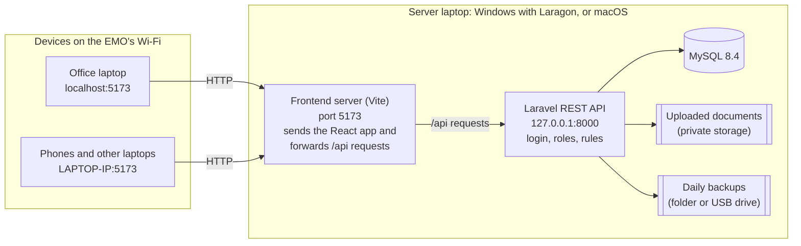
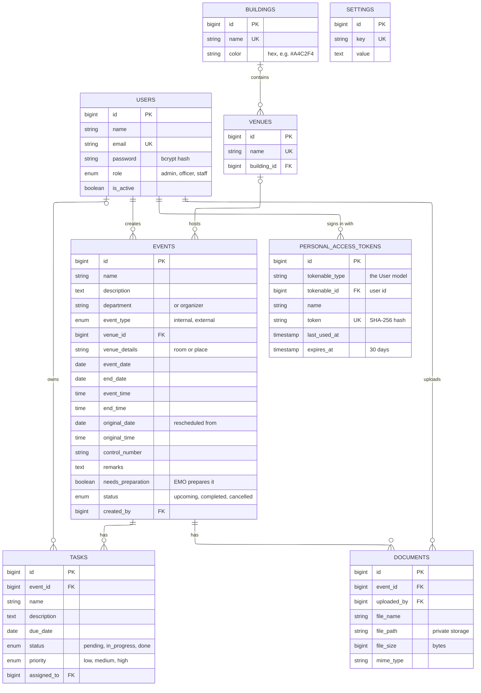
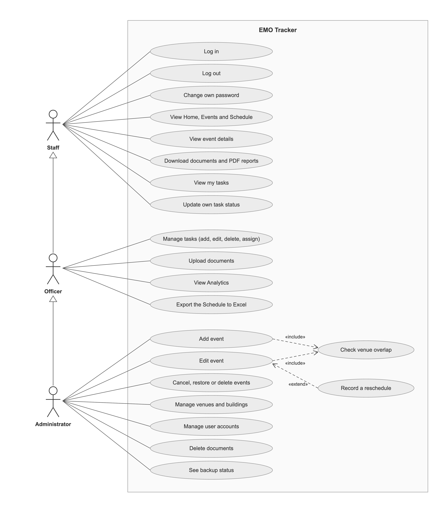
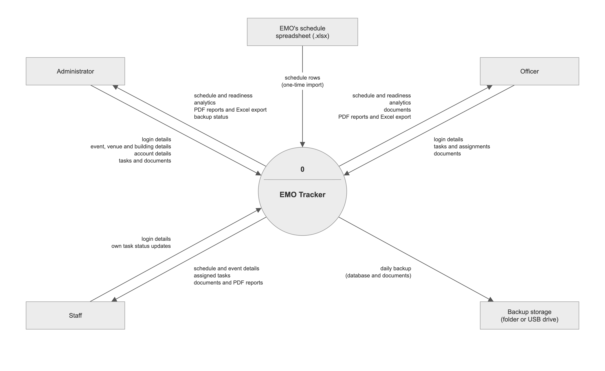
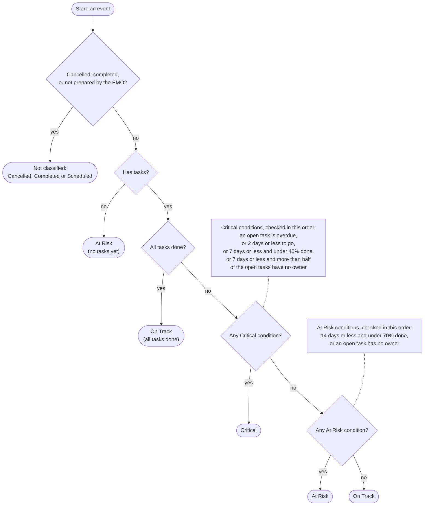
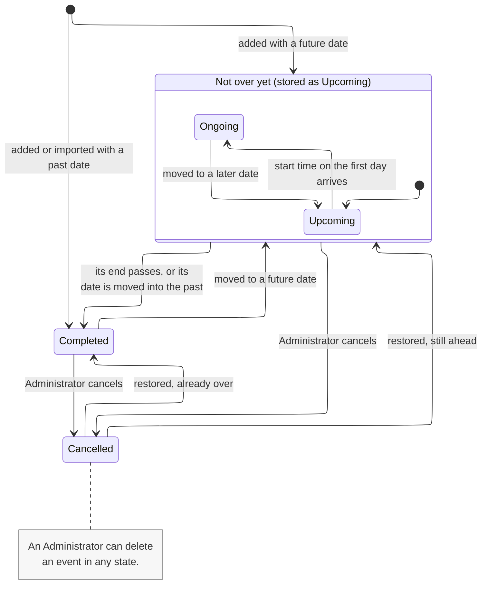
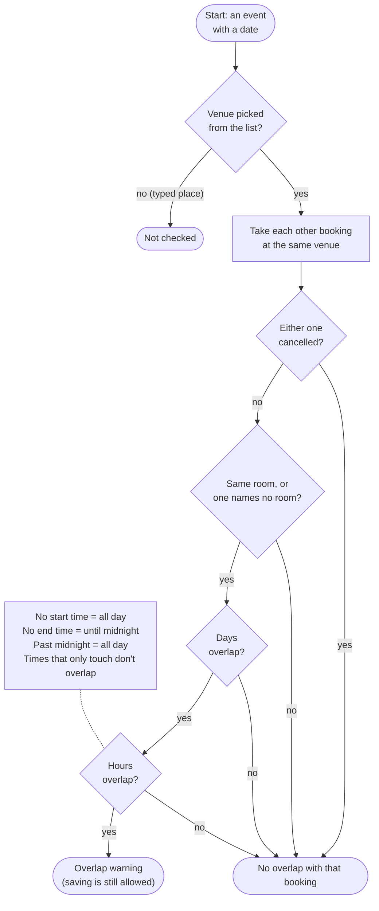
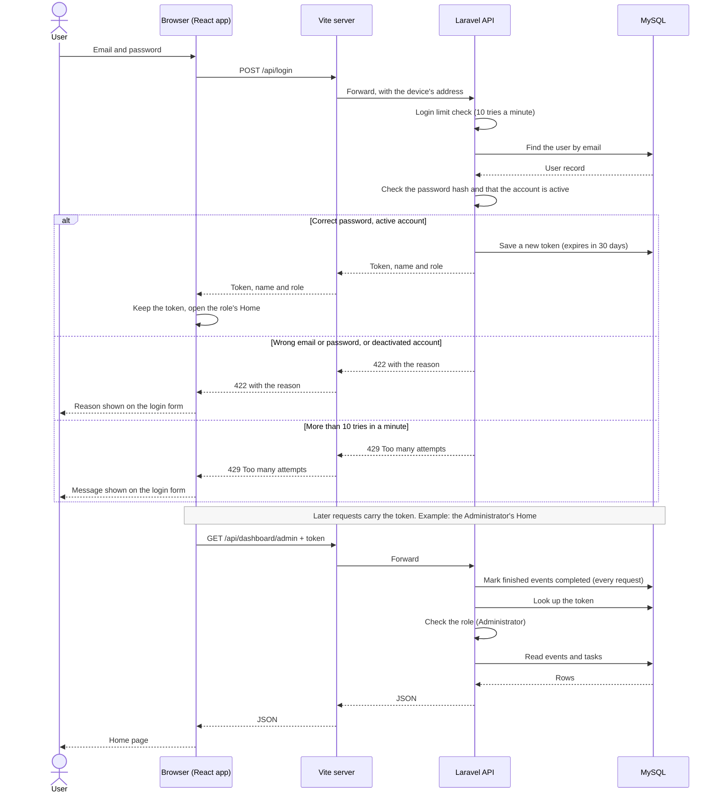

# EMO Tracker — Capstone 2 Paper Reference

> **For the team writing the Capstone 2 paper.** This is the single source of truth about the system as it is now. It replaces the Capstone 1 version of this file. Every fact here was checked against the code on **October 7, 2026**.
>
> Anything marked **[TO CONFIRM]** is a fact or decision the team still has to settle. Don't let an AI fill those in.

---

## How to use this document

### Which parts to use for each chapter

| You're writing | Give the AI | Also useful |
|---|---|---|
| Chapter 1: Introduction | Part A + Part C | Part B (what changed) |
| Chapter 2: Review of Related Literature and Systems | Part A + Part D | — |
| Chapter 3: Methodology and System Design | Part A + Part E | Part F (features), Appendix G (figures and copy-ready tables), [Diagram_Descriptions.md](Diagram_Descriptions.md) |
| Chapter 4: Results and Discussion | Part A + Part F + Part G | Appendix G (screenshots), [Screenshot_Descriptions.md](Screenshot_Descriptions.md) |
| Chapter 5: Summary, Conclusions and Recommendations | Part A + Part H | Part G |
| User's manual / appendices | Part A + Appendix E + Appendix F | Appendix G (screenshots), [Screenshot_Descriptions.md](Screenshot_Descriptions.md) |
| Defense preparation | Part A + Part I | Part B |

### Rules for using AI with this document

1. **Always paste Part A first**, then only the part for your chapter.
2. Start every prompt with: *"Use only the facts in the text below. If a fact you need isn't there, write [TO CONFIRM] instead of guessing."*
3. **Never let the AI write references or citations.** AI tools often invent books, articles and authors that don't exist, and a fake reference can sink a paper. Find real sources yourself (Google Scholar, the NEU library, official documentation sites), read them, and cite them yourself.
4. **Never let the AI invent numbers.** That includes survey results, respondents, percentages and performance figures. The only measured numbers so far are in Part G.
5. **Use the system's own terms** (see Appendix A): Administrator, Officer, Staff; On Track, At Risk, Critical; Upcoming, Ongoing, Completed, Cancelled; Rescheduled; "the EMO prepares this event"; Schedule; venue; building.
6. **Don't paste the EMO's real schedule** (event names, people's names) into AI tools. This document only contains totals, which are fine to use.
7. **Check every technical sentence the AI writes** against this document. If something here looks wrong, ask Xyrone before changing the paper.
8. Follow your adviser's and NEU's rules on using AI in the paper, including any disclosure they require. **[TO CONFIRM]**

### Example prompt

> I'm writing Chapter 1 of our Capstone 2 paper about EMO Tracker. Use only the facts below. If a fact you need isn't there, write [TO CONFIRM] instead of guessing. Use formal academic English in the third person, and don't add citations (we'll add our own). Write the Background of the Study in 3 to 4 paragraphs.
>
> *(paste Part A, then Part C)*

---

# Part A. Project summary (paste this first, every time)

**EMO Tracker** is a responsive web application built for the **Events Management Office (EMO) of New Era University (NEU)**. It does three things:

- It keeps the office's whole event schedule in one place.
- It tracks the tasks needed to prepare the events the EMO handles.
- It uses rule-based logic to label each prepared event **On Track, At Risk or Critical**, and shows the reason for the label.

It replaces the EMO's hand-typed schedule spreadsheet and its scattered way of tracking tasks.

- **Users:** about 5 to 10 EMO members **[TO CONFIRM exact number]**, in three roles:
  - **Administrator:** owns the schedule, the venues and the user accounts.
  - **Officer:** prepares events, through tasks, documents, reports and analytics.
  - **Staff:** works on and updates their own tasks.
- **What it does:**
  - **Planning and scheduling:** a calendar, a list, and a Schedule page laid out like the EMO's own spreadsheet.
  - **Event statuses:** Upcoming, Ongoing and Completed follow the date and time; Cancelled is set by hand; Rescheduled events are marked.
  - **Event types:** every event is Internal (an NEU event) or External (an outside organizer).
  - **Venues:** a managed list of venues grouped by building, with a warning when two bookings overlap.
  - **Tasks:** assigned to one owner each, with status tracking.
  - **Rule-based readiness classification:** the project's "AI" feature.
  - **Analytics:** statistics on the schedule and on event preparation.
  - **Records:** PDF event reports, an Excel export of the Schedule, and uploaded documents.
  - **Upkeep:** account management, automatic daily backups, and a one-time import of the EMO's spreadsheet.
- **Technology:** React 19, Vite and Tailwind CSS (frontend); a Laravel 13 (PHP 8.3) REST API using Sanctum tokens (backend); MySQL 8.4 (database). It uses no external services and no AI APIs.
- **Deployment:** the system runs on one laptop on the office's local network (LAN). Other devices on the same WiFi open it in a web browser. Daily use will be on the EMO's Windows laptop (with Laragon); the defense is presented on a MacBook.
- **Stage:**
  - **Capstone 1 (2026):** built the first version, with four core features.
  - **Capstone 2:** reworked the system around the EMO's real schedule and client feedback. It added several features, 110 automated tests and a pre-defense audit.
  - **Next:** user testing with the EMO is planned after the defense **[TO CONFIRM dates]**.

---

# Part B. What changed from Capstone 1 to Capstone 2

| Area | Capstone 1 | Capstone 2 (now) | Reason |
|---|---|---|---|
| Client's name | "EMD" | **Events Management Office (EMO)**; the app was renamed EMO Tracker | The client clarified the office's name (Oct 2, 2026) |
| What the system holds | Only the events the EMO prepares | **Every NEU event and venue booking** (the whole schedule). A switch marks the events the EMO prepares | The EMO keeps a schedule of about 50 bookings a month, and most of them need no preparation |
| Ways to view events | Calendar and list | Also a **Schedule page** like the EMO's sheet: one tab per year, grouped by month, colored by building, searchable | The client showed their Google Sheets schedule |
| Venues | Typed as free text | A **managed list of venues** inside buildings, each building with a color. Duplicates can be merged, and a room can be added as free text | The sheet had about 80 spellings for about 25 places |
| Event details | Name, description, venue, date, time, budget | Adds department or organizer, **Internal or External type**, end date, end time, control number, remarks and room. **Budget was removed** | Client: remove budget, classify internal and external events |
| Event statuses | Upcoming and Completed, by date | **Upcoming, Ongoing and Completed** by date and time, **Cancelled** (can be undone), and a **Rescheduled** mark | Client: show whether an event is cancelled, ongoing or rescheduled |
| Double-booking | Not handled | A **warning** when two bookings overlap at the same venue and room | 13 overlapping pairs were found in the real 2026 sheet |
| Who can edit events | Administrator and Officer | **Administrator only**; Officers prepare events (tasks, documents, reports) | One person owns the schedule |
| People on an event | A list of assigned staff per event (`event_staff` table) | An event's People are **everyone with a task on it**; the table was removed | Simpler: the EMO is small and everyone handles events |
| Who sees what | Staff saw only events assigned to them | **Everyone can see and open every event**; editing still depends on the role | The office has 5 to 10 people |
| Readiness rules | Critical if under 40% done, 2 days or less away, or most tasks unassigned. At Risk if under 70% done, 6 days or less away, or any task unassigned | **Time-aware rules** (Part E.8.1). Each label also states its reason, e.g. "1 task is overdue" | When tested on the real schedule, an event 14 days away was labeled Critical at 0% done |
| Analytics | Readiness statistics, a donut chart, the 5 most urgent events | Adds **schedule statistics** for a chosen period: statuses, rescheduled events, internal vs external, busiest venues | The client asked for analytics on event statuses |
| Home pages | Statistics cards and shortcut links | Built around **"what needs my attention"**: a one-sentence summary, a needs-attention list, the next 7 days, my open tasks, and the backup status (Administrator) | The shortcut links repeated the menu, and the cards competed with the list that matters most |
| Reports | PDF event report | Adds an **Excel export** of a year's Schedule, laid out like the EMO's sheet | For year-end records |
| Documents | Officers and Administrators could delete them | **Only the Administrator deletes documents**; deleting an event also deletes its files | Documents are records |
| Existing data | None | A **one-time import** of the EMO's spreadsheet, with a list of rows to review, plus automatic text cleanup | To bring in the real 2026 schedule |
| Backups | None | **Automatic daily backups** (database and documents), named snapshots, a restore command, and backup status on the Administrator's Home | The system runs on a single laptop |
| Security | Token login and roles | Adds **private file storage**, a **login limit for each account on each device**, sign-out of other devices on a password change, and **no technical error details** shown to users | Capstone 2 reviews and the pre-defense audit |
| Testing | Manual testing | **110 automated tests** (483 checks), browser walkthroughs, a load test and a pre-defense audit | Reliability |
| Starting the app | `start.bat` (Windows) | `start.bat` (now finds Laragon's PHP and applies database updates) and **`start.command` (Mac)** | Defense on a Mac, daily use on Windows |
| Number of features | Exactly 4 (per the briefing) | 4 core features (expanded) plus features added in Capstone 2 **[TO CONFIRM how to present them]** | The professor allowed more than 4 features if they fit the client's needs |

---

# Part C. Chapter 1 material (Introduction)

## C.1 Project identification

- **Title (Capstone 1):** *EMO Tracker: A Web Application for Event Planning and Task Management with Rule-Based Event Readiness Classification for the Events Management Office of New Era University.* Keep it unless the adviser approves a new title. Capstone 2 added scheduling, so a title that mentions it is an option. **[TO CONFIRM]**
- **Type:** responsive web application (works in desktop and phone browsers)
- **Client:** Events Management Office (EMO), New Era University, No. 9 Central Avenue, New Era, Quezon City, Philippines
- **Proponents:** Ylanan, Xyrone Kyle E.; Bacena, Phil Jade P.; Sy, Joana Daphne T.; Zabala, Jean Simone L.
- **Program and section:** BS Information Technology, section **[TO CONFIRM]** (it was 3BSIT-2 in Capstone 1)
- **Subject:** Capstone 2 (continuation of Capstone 1)
- **Adviser:** Prof. Teresita C. Alcantara
- **Institution:** New Era University, College of Informatics and Computing Studies
- **Year:** 2026. The Capstone 2 defense is in the first week of November 2026 **[TO CONFIRM date]**

## C.2 Background of the study (facts to build on)

**The office**
- The EMO organizes and oversees NEU events (for example Foundation Day, orientations, sports fests, recognition nights and inter-college competitions). It also keeps the schedule of NEU events and venue bookings.
- It has about 5 to 10 members, and all of them handle events. **[TO CONFIRM]**

**How the EMO keeps its schedule (studied in Capstone 2)**
- **One shared spreadsheet.** The schedule is a Google Sheets file typed by hand: one tab per year, rows colored by building, and seven columns (Date, Time, Event, Department, Venue, Control #, Remarks). The 2026 tab had about 330 rows.
- **Mostly bookings.** About 50 bookings are made a month. Most are venue bookings the EMO only records. A smaller number are events the EMO prepares.
- **Inconsistent venue names.** Venues are typed freely, giving about 80 different spellings for about 25 places (for example "UHALL" and "University Hall").
- **Changes hidden in text.** A reschedule is written as two rows ("Resched to June 9" on the old date, plus a row on the new date), and a cancellation is written in the remarks.
- **Overlaps go unnoticed.** Overlapping bookings are found only by noticing them. The 2026 sheet had 13 pairs of bookings at the same venue at overlapping times, 9 of them still upcoming when checked (October 2026).

**Problems already found in Capstone 1 (still valid)**
- No single place tracks event tasks and who does them.
- No objective way to tell which events need attention before they happen.
- Post-event reports are made by hand.

**The solution, in one paragraph:** EMO Tracker puts the schedule and the work behind each event in one locally hosted web application. Every booking gets a structured status, type and venue. Overlaps are flagged automatically, each prepared event gets a readiness label with a reason, and reports, statistics and backups are produced by the system.

## C.3 Statement of the problem (suggested Capstone 2 version)

**General problem:** The EMO has no centralized system for keeping its event schedule and for managing the preparation, readiness monitoring and reporting of the events it handles.

**Specific problems** (each one matches an objective in C.4):
1. How can the EMO keep every event and venue booking in one consistent, searchable schedule?
2. How can each event's status (upcoming, ongoing, completed, cancelled, rescheduled) and type (internal or external) be shown without manual updating?
3. How can conflicting venue bookings be noticed before they happen?
4. How can preparation tasks be assigned and tracked with clear accountability?
5. How can the office tell, objectively and with reasons, which prepared events need attention?
6. How can the office get schedule and preparation statistics, reports and records without manual work?
7. How can the office's data be kept secure and recoverable on a system hosted on a single laptop?
8. How do the EMO's users rate the system's quality and usability? **[TO CONFIRM instrument: SUS or ISO/IEC 25010, see E.11]**

## C.4 Objectives (suggested Capstone 2 version)

**General objective:** To develop and evaluate EMO Tracker, a responsive web application that centralizes the EMO's event schedule and the preparation, readiness monitoring and reporting of its events.

**Specific objectives:**
1. **Scheduling:** to build an event planning and scheduling module that records every event and venue booking and shows them in a calendar, a list, and a sheet-style Schedule by year. Each record holds its type, department or organizer, venue and room, dates, times, control number and remarks.
2. **Statuses:** to track each event's status automatically from its date and time (Upcoming, Ongoing, Completed), to allow cancelling and restoring events, and to record reschedules.
3. **Venues:** to manage venues and buildings, and to warn about double-bookings at the same venue and time.
4. **Tasks:** to implement task assignment and tracking with one owner per task, task statuses, a personal task list, and a lock on the tasks of completed events.
5. **Readiness:** to develop a rule-based readiness classifier that labels prepared events On Track, At Risk or Critical and states the reason, without machine learning or external AI services.
6. **Analytics:** to provide analytics for a chosen period, both on the schedule (statuses, reschedules, internal vs external, busiest venues) and on preparation (tasks, readiness distribution, most urgent events).
7. **Records:** to generate PDF event reports and Excel exports of the Schedule, and to manage event documents.
8. **Security and backups:** to secure the system with role-based access for three roles, token authentication and login limits, and to protect its data with automatic daily backups.
9. **Existing data:** to import the EMO's existing schedule spreadsheet.
10. **Evaluation:** to evaluate the system with the EMO's users using **[TO CONFIRM: SUS or ISO/IEC 25010]**.

## C.5 Scope and delimitations

**Scope**
- For internal use by the EMO only, on the office's local network, with one laptop acting as the server.
- Three roles: Administrator, Officer and Staff.
- The features listed in Part F.
- Runs in modern browsers on computers and phones. It was tested in Chrome at desktop and phone screen sizes; other browsers and real devices will be checked during the pilot **[TO CONFIRM]**.
- Data: the EMO's 2026 schedule was imported. Past years stay in the system (nothing is deleted at year end).

**Delimitations and limitations**

*Network and hosting*
- Users must be on the same network as the server laptop. If that laptop is off, no one can use the system.
- It isn't hosted on the internet, so there are no features that need internet access. That means no email or SMS notifications (the client asked for email; this is future work), no cloud sync and no external calendars.
- It runs on development servers (PHP's built-in server and Vite) on one laptop. That suits an office of about 10 users, not a large deployment.

*Accounts and tasks*
- Only an Administrator can create accounts; there's no self-registration. A forgotten password is reset by an Administrator, not by email.
- Each task has one owner. There are no recurring events or event templates.

*Rules and checks*
- The readiness classifier uses fixed rules and thresholds. It doesn't learn from past events, and it covers only the events the EMO prepares.
- The double-booking check is a warning, not a block. Places typed as free text (with no venue chosen from the list) aren't checked.

*Data and records*
- The spreadsheet import is a one-time migration, and a person must review the rows the system couldn't read with confidence. Departments typed differently (for example "CON" and "College of Nursing") aren't merged automatically.
- There's no audit trail (activity log) yet.
- Accepted files are PDF, Word, Excel, JPG and PNG, up to 10 MB each.
- Backups are stored locally, preferably on a USB drive. Restoring a backup is done with a command, not inside the app.
- All times are Philippine time (Asia/Manila).

## C.6 Significance of the study

- **For the EMO:**
  - one consistent schedule instead of a hand-typed sheet
  - overlaps flagged before they happen
  - clear statuses, and readiness labels that explain themselves
  - reports and statistics without manual work
  - protected records with daily backups
- **For NEU:** a student-built internal tool, made for a real office's workflow and handed over to it, that runs without paid services.
- **For the proponents:** experience building, testing and deploying a full-stack system with React, Laravel and MySQL around a real client's needs and data.
- **For future researchers:** an example of explainable rule-based classification, of moving a hand-typed spreadsheet into a structured database, and of a LAN-hosted system for a small office.

## C.7 Definition of terms

See Appendix A (Glossary).

---

# Part D. Chapter 2 material (Review of Related Literature and Systems)

> There are **no citations in this part on purpose.** Use the topics and keywords below to find real sources (Google Scholar, the NEU library, IEEE or ACM papers, books, official documentation). Read each source and cite it yourself. Don't ask an AI for references.

## D.1 Topics to cover, and search keywords

| Topic | Why it's related | Search keywords |
|---|---|---|
| Event management and scheduling systems | What EMO Tracker is | "event management system", "university event management", "venue booking system", "facility reservation system" |
| Spreadsheets as office tools, and their errors | The EMO's current method | "spreadsheet errors", "end-user computing", "data quality spreadsheets" |
| Task management and accountability | Tasks with one owner | "task management system", "accountability in task assignment", "small team project management" |
| Rule-based systems as AI | The readiness classifier | "rule-based expert system", "production rules", "rule-based classification", "explainable artificial intelligence" |
| Status indicators in project tracking | On Track / At Risk / Critical | "RAG status project management" (red, amber, green), "project health indicators" |
| Scheduling conflicts and double-booking | The overlap warning | "resource scheduling conflict", "room booking conflict detection", "interval overlap" |
| Web application architecture | System design | "single-page application", "REST API", "three-tier architecture", "client-server" |
| Access control | The three roles | "role-based access control", "token-based authentication" |
| Data backup and recovery | Daily backups | "data backup small organizations", "backup and recovery" |
| Software quality and usability evaluation | The evaluation | "ISO/IEC 25010", "System Usability Scale" |
| Locally hosted school systems | LAN deployment | "LAN-based information system", "intranet application school" |

## D.2 Comparing approaches (a table to fill in)

Compare EMO Tracker with the tools the EMO could otherwise use. **Check every claim about another product on its official website before using it in the paper.**

| Criterion | Spreadsheet (current method) | Shared calendar app | General task-board app | Commercial event platform | EMO Tracker |
|---|---|---|---|---|---|
| Whole schedule in a sheet-like view | [research] | [research] | [research] | [research] | Yes |
| Consistent venue list | [research] | [research] | [research] | [research] | Yes |
| Double-booking warning | [research] | [research] | [research] | [research] | Yes (warning) |
| Event statuses and reschedule history | [research] | [research] | [research] | [research] | Yes |
| Tasks with owners and deadlines | [research] | [research] | [research] | [research] | Yes |
| Readiness labels with reasons | [research] | [research] | [research] | [research] | Yes (rule-based) |
| Works without internet (on the LAN) | [research] | [research] | [research] | [research] | Yes |
| Cost | [research] | [research] | [research] | [research] | Free to the EMO |

## D.3 Points for the synthesis

- Most general-purpose tools either keep a schedule *or* track tasks. EMO Tracker links each event on the schedule to its preparation tasks and readiness.
- Rule-based classification was chosen over machine learning because there's no labeled history of event outcomes to learn from. It also gives explainable results (every label states its reason), and the curriculum's "AI" requirement excludes AI APIs and machine learning.
- The double-booking check is a warning instead of a block because some overlaps are intentional. The office keeps the final say.

---

# Part E. Chapter 3 material (Methodology and System Design)

## E.1 Development approach and timeline

- **Approach:** iterative, phase-based development. Each phase was built, checked and then extended. Capstone 2 added iterations driven by client feedback. **[TO CONFIRM: use the same SDLC model your Capstone 1 paper named (for example Agile or iterative and incremental), and describe Capstone 2 as further iterations of it.]**

| When | Phase | What was done |
|---|---|---|
| May 2026 | Capstone 1, Phases 0–8 | Setup, database, login and roles, dashboards, events (calendar and list), tasks, readiness classifier and analytics, PDF reports and documents, polishing and preparing the LAN demo |
| Sep 28, 2026 | Capstone 2, Phase 9 (kickoff review) | Fixed access-control gaps, a classifier edge case and the time zone (UTC to Asia/Manila); moved documents to private storage; added a login limit and the first 30 automated tests |
| Oct 2, 2026 | Phase 10, client consultation 1 **[TO CONFIRM format]** | Client clarified the office's name (EMO) and showed the schedule sheet. Built the Schedule page, the venue list with buildings, the "EMO prepares this event" switch, the import of the real 2026 sheet and the text cleanup |
| Oct 6, 2026 | Phase 10, client consultation 2 **[TO CONFIRM format]** | Client asked to remove budget, to show cancelled/ongoing/rescheduled events, to classify Internal/External (visible on the Schedule) and for status analytics. The professor allowed more than 4 features. Built the status lifecycle, the reschedule mark, the event types, the new analytics and the double-booking warning |
| Oct 7, 2026 | Pre-defense audit | Reviewed the whole system for anything that could fail, confuse a user or look unfinished; fixed the findings (see G.6) |
| Early Nov 2026 | Capstone 2 defense | Presented on a MacBook with the EMO's shared data |
| After the defense | Pilot and evaluation **[TO CONFIRM]** | Install on the EMO's Windows laptop with their latest data; 1 to 2 weeks of real use; survey |

- **Requirements gathering:**
  - consultations with the EMO (above)
  - analysis of the EMO's own schedule spreadsheet (its columns, colors, typing patterns, reschedule and cancellation notes, venue spellings and overlaps)
  - guidance from the adviser and professor
- **Development tools:**

| Tool | Used for |
|---|---|
| Git and GitHub | Version control and collaboration (repository: XyroneKyleYlanan/EMO-Tracker) |
| Laragon (Windows) / Homebrew (macOS) | Local PHP and MySQL |
| Composer and npm (Node.js 20) | Backend and frontend packages |
| PHPUnit 12 | Automated tests |
| Laravel Pint and ESLint | Code style and code checks |
| Chrome DevTools and Playwright | Browser testing at desktop and phone sizes |
| Code editor | **[TO CONFIRM which editors the team used]** |

## E.2 Technical stack

| Layer | Technology | Version | Purpose |
|---|---|---|---|
| Frontend | React | 19.2 | Component-based user interface (single-page application) |
| Frontend | React Router | 7.18 | Pages and role-based routes in the browser |
| Frontend | Vite | 8.3 | Development server and build tool; forwards API requests to Laravel |
| Frontend | Tailwind CSS | 4.3 | Responsive styling with utility classes |
| Frontend | axios | 1.20 | API requests (adds the login token to each request) |
| Frontend | FullCalendar | 6.1 | Monthly calendar view (a UI library, not a service) |
| Frontend | Recharts | 3.8 | Readiness donut chart (a UI library, not a service) |
| Frontend | San Francisco / Inter (fonts) | Inter 5.3 | Apple devices use their own San Francisco font; Windows and Android use Inter, its closest free match, bundled with the app so it works without internet (Apple's license keeps San Francisco on Apple devices) |
| Backend | Laravel | 13.34 | REST API: routing, validation, database access, security |
| Backend | PHP | 8.3 | Language Laravel 13 requires |
| Backend | Laravel Sanctum | 4.3 | Token-based login for the API |
| Backend | barryvdh/laravel-dompdf | 3.1 | Makes PDF reports on the server (a package, not a service) |
| Backend | PhpSpreadsheet | 5.10 | Reads the EMO's .xlsx sheet (import) and writes the Excel export |
| Database | MySQL | 8.4 | Relational database |
| Local server | Laragon (Windows) or Homebrew (macOS) | — | Provides PHP and MySQL on the server laptop |

**Compliance notes (per the professor's rules)**
- **No external service APIs.** All data and logic stay on the server laptop.
- **No machine learning and no AI APIs.** The readiness classification is plain, deterministic PHP rules (`EventClassifier`).
- **UI libraries aren't APIs.** FullCalendar, Recharts and Tailwind run inside the app and call no outside servers.
- **No cloud hosting.** The system runs on the office's LAN.

## E.3 System architecture

EMO Tracker uses a **three-tier, client-server architecture**:
1. **Presentation tier:** a React single-page application running in each user's browser.
2. **Application tier:** a Laravel REST API that returns JSON. It enforces every rule: login, roles, validation, locks, readiness, overlaps, statuses and backups.
3. **Data tier:** a MySQL database, plus private file storage for uploaded documents and a backup folder.



**How a request travels**
- Browsers connect over plain HTTP to port 5173 on the server laptop. The frontend server forwards every `/api` request to Laravel, which only listens on the laptop itself (127.0.0.1:8000). Users never connect to Laravel directly.
- The frontend server tells Laravel which device each request came from. The login limit uses this.

**What happens on every API request**
1. The response is always JSON.
2. Events whose end time has passed are marked Completed.
3. The login token is checked, and tokens of deactivated accounts are rejected.
4. The user's role is checked against the route.
5. The controller validates the input and applies the rules.
6. After the response is sent, the first request of the day also makes the daily backup.

**Backend services (business logic)**

| Service | Job |
|---|---|
| `EventClassifier` | Readiness labels and their reasons |
| `VenueClashes` | Double-booking check |
| `ScheduleImport` | One-time spreadsheet import |
| `TextTidy` / `ScheduleTidy` | Text cleanup |
| `ScheduleExport` | Excel export |
| `Backup` | Backups and restore |

## E.4 Database design

The database has **7 application tables**: `users`, `buildings`, `venues`, `events`, `tasks`, `documents` and `settings`. Laravel adds its own tables for logins and housekeeping: `personal_access_tokens`, `sessions`, `cache`, `cache_locks`, `jobs`, `job_batches`, `failed_jobs`, `password_reset_tokens` and `migrations`.

Two changes since Capstone 1: the `event_staff` table was removed (an event's People are its task owners), and `buildings` and `venues` were added.

The ERD shows the 7 application tables plus `personal_access_tokens`, because logging in writes to it (E.8.4). To stay readable, it leaves out the `created_at` and `updated_at` columns that every table has, and two Laravel columns on `users` (`email_verified_at`, `remember_token`). The data dictionary below lists every column.



### Data dictionary

The same tables, ready to paste into Word, are in [data-dictionary.html](tables/data-dictionary.html) (see Appendix G).

Every table also has `created_at` and `updated_at` timestamps.

**users**: everyone who can log in.

| Column | Type | Rules | Meaning |
|---|---|---|---|
| id | bigint | primary key | |
| name | varchar(255) | required | Full name |
| email | varchar(255) | required, unique | Login name |
| email_verified_at | timestamp | optional | Set when an Administrator creates the account |
| password | varchar(255) | required | bcrypt hash (12 rounds); never stored in plain text |
| role | enum(admin, officer, staff) | default staff | Decides what the person can do |
| is_active | boolean | default true | Deactivated accounts can't log in; accounts are never deleted |
| remember_token | varchar(100) | optional | Laravel default |

**buildings**: the groups that color the Schedule.

| Column | Type | Rules | Meaning |
|---|---|---|---|
| id | bigint | primary key | |
| name | varchar(255) | required, unique | e.g. "UHALL" |
| color | varchar(7) | required | Hex color, from a palette of 24 light colors |

**venues**: places that can be booked.

| Column | Type | Rules | Meaning |
|---|---|---|---|
| id | bigint | primary key | |
| name | varchar(255) | required, unique | e.g. "University Hall" |
| building_id | bigint | optional, → buildings.id (set to empty if the building is removed) | Its building; none means shown in gray |

**events**: every event and venue booking on the schedule.

| Column | Type | Rules | Meaning |
|---|---|---|---|
| id | bigint | primary key | |
| name | varchar(255) | required | Event name |
| description | text | optional | |
| department | varchar(255) | optional | Requesting department, or the organizer of an external event |
| event_type | enum(internal, external) | default internal | Internal = an NEU event; External = an outside organizer |
| venue_id | bigint | optional, → venues.id (set to empty if the venue is deleted) | Venue from the list |
| venue_details | varchar(255) | required when there's no venue | The room (with a venue) or the place (without one) |
| event_date | date | required | First day |
| end_date | date | optional, not before event_date | Last day, for multi-day events |
| event_time / end_time | time | optional; on a one-day event the end must be after the start | No time means all day |
| original_date / original_time | date / time | optional | Where a rescheduled event was first scheduled |
| control_number | varchar(255) | optional | The EMO's control number |
| remarks | text | optional, up to 2,000 characters | |
| needs_preparation | boolean | default false | "The EMO prepares this event": turns on readiness tracking |
| status | enum(upcoming, completed, cancelled) | default upcoming | Stored status. "Ongoing" is worked out from the date and time |
| created_by | bigint | required, → users.id | Who added it |

**tasks**: the work needed to prepare an event.

| Column | Type | Rules | Meaning |
|---|---|---|---|
| id | bigint | primary key | |
| event_id | bigint | required, → events.id (deleted with the event) | |
| name | varchar(255) | required | |
| description | text | optional | |
| due_date | date | required | Can be after the event, with a warning |
| status | enum(pending, in_progress, done) | default pending | |
| priority | enum(low, medium, high) | default medium | |
| assigned_to | bigint | optional, → users.id | The one owner (any active member, any role) |

**documents**: files attached to an event.

| Column | Type | Rules | Meaning |
|---|---|---|---|
| id | bigint | primary key | |
| event_id | bigint | required, → events.id (deleted with the event) | |
| uploaded_by | bigint | required, → users.id | |
| file_name | varchar(255) | required | Original file name |
| file_path | varchar(255) | required | Location in private storage (never sent to browsers) |
| file_size | bigint | required | Bytes |
| mime_type | varchar(255) | required | File type |

**settings**: key and value pairs. The demo data has school-year settings (`school_year_start_month`, `school_year_end_month`, `current_school_year`), which the app doesn't use yet.

**What happens when something is deleted**
- Deleting an event deletes its tasks, its document records and its files.
- Deleting a venue or building leaves events and venues in place, without a venue or building. A venue used by events can't be deleted; it can be merged instead.
- People are deactivated, never deleted, so their records stay.

## E.5 Roles and permissions

| Action | Administrator | Officer | Staff |
|---|:-:|:-:|:-:|
| Log in, log out, change own password | ✓ | ✓ | ✓ |
| See Home, the Schedule, the Events page and every event's details | ✓ | ✓ | ✓ |
| Download documents and PDF reports | ✓ | ✓ | ✓ |
| My tasks; update the status of own tasks | ✓ | ✓ | ✓ |
| Add, edit, delete and assign tasks; change any task's status | ✓ | ✓ | |
| Upload documents | ✓ | ✓ | |
| View Analytics; export the Schedule to Excel | ✓ | ✓ | |
| Add, edit, cancel, reschedule and delete events | ✓ | | |
| Manage venues and buildings | ✓ | | |
| Delete documents | ✓ | | |
| Manage accounts (create, edit, deactivate, reset passwords) | ✓ | | |
| See backup status | ✓ | | |
| Change the tasks of a **completed** event | ✓ (with confirmation) | | |

Roles are checked twice: by the backend on every request, and by the frontend, which hides pages and buttons. The backend check is the one that matters, because it can't be bypassed through the browser.

## E.6 Use cases



The diagram uses standard UML use case notation: stick figures for the actors, ovals for the use cases, and a box for the system boundary. Mermaid can't draw UML use case diagrams, so this one is drawn as an SVG file ([`diagrams/src/use-cases.svg`](diagrams/src/use-cases.svg)). It opens in any browser and can be edited in a vector editor such as Inkscape.

- **Generalization** (solid line with a hollow triangle): an Officer is a kind of Staff member and can do everything Staff can, and an Administrator can do everything an Officer can.
- **«include»:** adding or editing an event always runs the venue overlap check.
- **«extend»:** when the start date or time of an event changes, the Administrator can record it as a reschedule.

| Actor | Use cases (each actor also has the use cases of the actors above it) |
|---|---|
| Staff | Log in; Log out; Change own password; View Home, Events and Schedule; View event details; Download documents and PDF reports; View my tasks; Update own task status |
| Officer | Manage tasks (add, edit, delete, assign); Upload documents; View Analytics; Export the Schedule to Excel |
| Administrator | Add event; Edit event; Cancel, restore or delete events; Manage venues and buildings; Manage user accounts; Delete documents; See backup status |

## E.7 Context diagram (data flow, level 0)



Drawn in Yourdon–DeMarco notation: the whole system is one process (numbered 0), the outside entities are rectangles, and each arrow is a labeled data flow. It's an SVG file ([`diagrams/src/context-diagram.svg`](diagrams/src/context-diagram.svg)), like the use case diagram, so the flows could be laid out without crossing.

| Entity | Data flowing in to EMO Tracker | Data flowing out of EMO Tracker |
|---|---|---|
| Administrator | Login details; event, venue, building and account details; tasks and documents | Schedule and readiness; analytics; PDF reports and Excel export; backup status |
| Officer | Login details; tasks and task assignments; documents | Schedule and readiness; analytics; documents; PDF reports and Excel export |
| Staff | Login details; status updates for their own tasks | Schedule and event details; assigned tasks; documents and PDF reports |
| EMO's schedule spreadsheet (.xlsx) | Schedule rows, imported once from the command line (`schedule:import`) when the system is installed | |
| Backup storage | | Daily backup of the database and documents (a folder on the laptop by default, or a USB drive set with `BACKUP_PATH`) |

## E.8 Processes and algorithms

### E.8.1 Rule-based readiness classification (the "AI" feature)

**What it is:** a deterministic, rule-based classifier in `App\Services\EventClassifier`. It encodes how the office judges whether an event is ready, much like a small expert system (a set of production rules). It uses no machine learning, training data or external API. The frontend only displays the label the backend sends.

**What it looks at** for an event the EMO prepares:
- days until the event's first day
- the percentage of tasks done
- the number of open tasks past their due date
- the number of open tasks with no owner

**Rules, checked in this order** (the first match decides):

```
if the event is cancelled                → "Cancelled"  (not classified)
if the event is completed                → "Completed"
if the EMO doesn't prepare the event     → "Scheduled"  (not classified)
if the event has no tasks                → At Risk   "No tasks yet"
if every task is done                    → On Track  "All tasks done"
-- Critical --
if any open task is past its due date    → Critical  "1 task is overdue" / "N tasks are overdue"
if the event is 2 days away or less      → Critical  "N tasks still open, event is tomorrow"
if 7 days or less and under 40% done     → Critical  "Only 20% done, 5 days to go"
if 7 days or less and more than half of
   the open tasks have no owner          → Critical  "3 of 4 open tasks have no owner, 6 days to go"
-- At Risk --
if 14 days or less and under 70% done    → At Risk   "60% done, 10 days to go"
if any open task has no owner            → At Risk   "1 open task has no owner"
-- otherwise --
                                         → On Track  "80% done, nothing overdue"
```



**Worked examples** (all events the EMO prepares; none of their open tasks are overdue unless stated):

| Days to go | Tasks | Done | Without owner | Result | Reason shown |
|---|---|---|---|---|---|
| 20 | 5 | 0 | 0 | On Track | "0% done, nothing overdue" (it's still early) |
| 10 | 5 | 2 (40%) | 0 | At Risk | "40% done, 10 days to go" |
| 5 | 5 | 1 (20%) | 0 | Critical | "Only 20% done, 5 days to go" |
| 30 | 4 | 2 | 0, but one task is overdue | Critical | "1 task is overdue" |
| 1 | 5 | 4 | 0 | Critical | "1 task still open, event is tomorrow" |
| 20 | 4 | 3 | 1 | At Risk | "1 open task has no owner" |
| any | 3 | 3 | — | On Track | "All tasks done" |
| any | 0 | — | — | At Risk | "No tasks yet" |

**Why the rules changed in Capstone 2:** with the original rules, an event got Critical as soon as tasks were added (0% done is under 40%), even when it was weeks away, and overdue tasks were ignored. Testing on the EMO's real schedule showed an event 14 days away labeled Critical. Progress is now judged only as the event gets close (within 14 days for At Risk, within 7 days for Critical), and an overdue task makes an event Critical at any time. Each label states its reason, so users can see why.

**Where the labels appear:**
- event cards, calendar colors and badges
- the event panel and Home's "Needs attention" list
- Analytics (the donut chart and the most urgent events)
- the PDF report

**The thresholds** (2, 7 and 14 days; 40% and 70%) are constants in one file, so they can be adjusted after user testing.

### E.8.2 Event status lifecycle

- **Stored statuses** are Upcoming, Completed and Cancelled. **Ongoing** isn't stored: it's worked out from the date and time.
- An event is **Ongoing** from its start time on the first day until its end time on the last day. Without times, the event lasts all day; without an end time, it lasts until the end of the last day.
- It becomes **Completed** once its end passes. This is checked at the start of every request, so it happens right away whichever page is open. An event added with a past date starts out Completed.
- **Cancelled** is set by the Administrator, from any other status (a completed event too, for example one that was entered but never held), and can be undone. When it's restored, the status follows the date again.
- Changing an event's dates **recalculates its status**. Moving a completed event to a future date reopens it, and moving an upcoming event into the past completes it.
- **Rescheduled** is a mark, not a status:
  - When an Administrator changes the start date or time, the form asks whether the event was moved (a reschedule) or entered wrong (a correction).
  - A reschedule saves where the event was first scheduled, shown as "Rescheduled from Fri, Oct 3".
  - Moving the event back to its original slot removes the mark.
  - The event keeps its tasks, documents and readiness.



**What each status changes:**
- **Completed:** non-admins can't change the event's tasks, and the Administrator must confirm any change.
- **Cancelled:**
  - The event stays on the Schedule and Home, struck through.
  - No new tasks can be added, and existing tasks are on hold (listed but not counted).
  - It's left out of readiness, overlap checks and venue statistics.

### E.8.3 Double-booking (venue overlap) check

Two bookings **overlap** when all of these are true:
1. They use the same venue from the venue list.
2. They're in the same room, or one of them names no room (it takes the whole venue). Rooms are compared ignoring capital letters and extra spaces.
3. Neither is cancelled.
4. Their days overlap. A multi-day event covers every day from its start date to its end date.
5. Their hours overlap:
   - No start time counts as all day, and no end time runs to the end of the day.
   - Times that run past midnight count as all day.
   - Bookings that only touch (8–10 AM and 10–12 PM) don't overlap.

Places typed as free text (with no venue chosen) aren't checked, because they can't be compared reliably.

**Where the warning appears:**
- **Event form:** while the venue, date and time are being chosen, about half a second after each change. A short note also stays next to the Save button.
- **Event panel:** shown to everyone, for upcoming events.
- **Schedule:** an "Overlap" label on upcoming clashing events, with the other event's name on hover. Searching "overlap" finds them.

**It's a warning, not a block:** some overlaps are on purpose (for example a rehearsal right before its own event), so the event can still be saved.



### E.8.4 Login and a typical request



### E.8.5 Daily backup

- **When:** on the first use each day, after the response is sent (users don't wait).
- **What:** the database and all uploaded documents, in one `.zip`. It's written in plain PHP, so it works the same on Windows and Mac.
- **How many:**
  - the newest **14** daily backups are kept for each database
  - **named snapshots** (`php artisan backup:run --name=...`) are never deleted automatically
  - the start files save a snapshot before applying a database update
- **If it fails:**
  - the request isn't affected
  - the error is logged and the Administrator's Home shows a warning
  - it's retried an hour later
- **Restore:** `php artisan backup:restore` (asks first) replaces all data and documents with a backup, then brings an older backup up to the current database structure.
- **Where:** `BACKUP_PATH` can point to a USB drive or a second disk, so a broken laptop doesn't take the backups with it.

### E.8.6 Spreadsheet import (one-time migration)

Run once by the developer or Administrator: `php artisan schedule:import <file.xlsx> --dry-run` checks the file first, then running it again without `--dry-run` imports it.

1. **Reads each tab** (one per year) and finds the columns by their headers: DATE, TIME, EVENT, DEPARTMENT, VENUE, CONTROL #, REMARKS, and optionally TYPE.
2. **Reads hand-typed dates and times:**
   - dates like "October 26-28" (multi-day), "Septmber 19" and "SEPT. 4-13"
   - the tab's year wins when a date was typed with the wrong year
   - a missing AM/PM is filled in the way a person would read it
   - unreadable times go into the remarks, with a note
3. **Matches venue spellings** to the managed venue list using known aliases (for example "UHALL" becomes University Hall), and keeps the rest as the room or details.
4. **Merges reschedule pairs** ("Resched to June 9" plus the June 9 row) into one rescheduled event.
5. **Skips rows already imported**, so it's safe to run again.
6. **Lists rows it couldn't read with confidence** in a review file kept in private storage, which is never put in the repository because it contains real names.
7. **Cleans the text** with the same tidy rules as `php artisan schedule:tidy`: consistent capitalization that keeps acronyms, brand names and Filipino particles, known typos, spacing, and room numbers (for example "rm201" becomes "Room 201").

## E.9 Security design

**Authentication**
- Login uses an email address and a password. Passwords are stored as bcrypt hashes (12 rounds).
- Laravel Sanctum issues a token that expires after 30 days. Logging out deletes it.
- **Login limit:** 10 tries a minute for each account on each device, with a plain "Too many login attempts" message. It slows down password guessing without locking out the rest of the office.
- **Changing a password** signs the account out on its other devices. An Administrator setting someone's new password signs that person out everywhere.
- Deactivated accounts are rejected on every request, and their sessions are ended. An Administrator can't deactivate or demote themselves, so there's always an active Administrator.

**Authorization**
- Roles are checked by the backend on every protected route; the frontend also hides what a role can't use.
- **Completed-event lock:** only an Administrator can change a completed event's tasks, with on-screen confirmation. The backend enforces this (HTTP 403).
- Only the Administrator edits event details and deletes documents.

**Data and files**
- Uploaded files are kept in **private storage** with no public web address. They're only downloaded through the logged-in API, and their storage paths are never sent to browsers.
- Uploads are limited to PDF, Word, Excel, JPG and PNG, up to 10 MB each. The limit is checked in the browser before uploading, by Laravel, and by PHP, whose limit the app raises to fit.
- Input is validated on the server. Eloquent's parameterized queries prevent SQL injection, and React escapes text by default (against cross-site scripting).
- **No technical details in errors:** error messages never show code, file paths or stack traces (debug mode is off). An item deleted by someone else gives a plain message: "This item no longer exists. It may have been deleted. Refresh the page."
- Automatic daily backups protect against data loss (E.8.5).

**Known trade-off:** tokens are kept in the browser's localStorage. That's acceptable on a trusted office LAN with about ten known users; an internet deployment should use httpOnly cookies instead.

## E.10 Deployment and operation

- **Server laptop:**
  - **The EMO's machine (daily use):** Windows with Laragon (PHP 8.3 or newer and MySQL 8.4) and Node.js 20 or newer. **[TO CONFIRM its specs]**
  - **The defense machine:** a MacBook with Homebrew.
- **Other devices:** any modern browser on the same WiFi, opening `http://LAPTOP-IP:5173`.
- **Starting the app:** double-click `start.bat` (Windows) or `start.command` (Mac). It:
  1. finds PHP (on Windows, Laragon's PHP, even after Laragon updates)
  2. applies any database changes that came with a new version, saving a backup first
  3. starts the Laravel API and the frontend server
  4. opens the browser
  5. prints the address other devices can use (Mac)
- **Updating:** `git pull`, `composer install`, `npm install`, then start the app as usual; the start file applies database changes itself.
- **No internet needed** after installation; everything runs on the LAN.
- **After the defense:** install it on the EMO's Windows laptop with their latest data, point `BACKUP_PATH` to a USB drive, and run a pilot of 1 to 2 weeks. **[TO CONFIRM dates]**

## E.11 Testing and evaluation plan

**Testing during development** (results in Part G)
1. **Automated tests:** 110 test cases with PHPUnit, run with `php artisan test`. They run on a temporary in-memory database, so they never touch real data.
2. **Browser walkthroughs:** every page for each role, at desktop and phone sizes.
3. **Load check:** response times with a few hundred events.
4. **Pre-defense audit:** a full review of anything that could fail, confuse a user or look unfinished.

**User evaluation (planned)**
- **When:** during the pilot at the EMO, after 1 to 2 weeks of real use. **[TO CONFIRM]**
- **Who:**
  - all EMO members, by total enumeration, since there are only 5 to 10 **[TO CONFIRM]**
  - IT experts as additional evaluators, if the adviser requires them **[TO CONFIRM]**
- **How:**
  1. Respondents carry out task scenarios (Appendix F).
  2. They answer the questionnaire **[TO CONFIRM: SUS or ISO/IEC 25010]**.

**Option 1: System Usability Scale (SUS).** The standard 10 statements, rated 1 (strongly disagree) to 5 (strongly agree):
1. I think that I would like to use this system frequently.
2. I found the system unnecessarily complex.
3. I thought the system was easy to use.
4. I think that I would need the support of a technical person to be able to use this system.
5. I found the various functions in this system were well integrated.
6. I thought there was too much inconsistency in this system.
7. I would imagine that most people would learn to use this system very quickly.
8. I found the system very cumbersome to use.
9. I felt very confident using the system.
10. I needed to learn a lot of things before I could get going with this system.

*Scoring:* for odd-numbered items, subtract 1 from the rating; for even-numbered items, subtract the rating from 5. Add the ten results and multiply by 2.5 to get a score from 0 to 100, then average the scores of all respondents. A score of about 68 is commonly cited as average. SUS was created by John Brooke (1996); find and cite the original source yourself.

**Option 2: ISO/IEC 25010 quality characteristics.** **[TO CONFIRM with the adviser which edition to use.]**
- **2011 edition (common in capstone papers):** Functional Suitability, Performance Efficiency, Compatibility, Usability, Reliability, Security, Maintainability and Portability.
- **2023 revision:** renames Usability to Interaction Capability and Portability to Flexibility, and adds Safety.

Sample statements for EMO Tracker (rate 1 to 5):

| Characteristic | Sample statements |
|---|---|
| Functional suitability | The system records every event with its type, venue, date and time. The readiness labels match how ready the events really are. |
| Performance efficiency | Pages and the Schedule load quickly on my device. |
| Compatibility | The system works on my phone and on a laptop browser at the same time as other users. |
| Usability | I can find an event, add a task and update its status without help. The reason shown with each readiness label is clear. |
| Reliability | The system worked without errors during the pilot. When something failed, the message told me what to do. |
| Security | Each role sees only the actions it should. I trust that records of completed events can't be changed casually. |
| Maintainability | (for IT evaluators) The system is organized so it can be updated and fixed easily. |
| Portability | The system was easy to install on the office laptop. |

*Interpretation:* compute the weighted mean of each statement and of each characteristic. A common 5-point scale is: 4.21–5.00 Strongly Agree (Excellent), 3.41–4.20 Agree (Very Good), 2.61–3.40 Neutral (Good), 1.81–2.60 Disagree (Fair), 1.00–1.80 Strongly Disagree (Poor). **[TO CONFIRM the labels your adviser wants]**

---

# Part F. The system's features in detail

**Core features from Capstone 1** (all expanded in Capstone 2):
- F1: Event Planning and Scheduling
- F2: Task Assignment and Tracking
- F3: Rule-Based Readiness Classification, with Analytics
- F4: Reports and Document Management

**Features added in Capstone 2:**
- F5: Schedule Management (Schedule page, venues and buildings, event statuses, Internal/External)
- F6: Venue Double-Booking Warning
- F7: Data Protection and Migration (automatic backups, spreadsheet import, Excel export)

**[TO CONFIRM with the adviser how to number and present the features in the paper.]**

### Accounts and login
- **Login:** email and password, with clear messages for wrong credentials, deactivated accounts, too many attempts, and a server that can't be reached.
- **Menus by role:**
  - Administrator: Home, My tasks, Events, Schedule, Analytics and Accounts, plus Venues from the Schedule.
  - Officer: Home, My tasks, Events, Schedule and Analytics.
  - Staff: Home, My tasks, My events and Schedule.
  - On phones, the menu becomes a bar at the bottom of the screen.
- **Change password:** current password, new password (at least 8 characters) and confirmation. Changing it signs out the account's other devices.

### Home pages ("what needs my attention")
- **Administrator and Officer:**
  - **Summary sentence** under the greeting, instead of a row of number cards. For example: "Of the 4 EMO-prepared events, 4 need attention. Across them, 9 tasks are still open (2 overdue) and 5 of 14 are done. The schedule has 11 events in the next 7 days."
  - **Needs attention** (the widest column, because it is the reason to open Home): prepared events labeled Critical or At Risk, most urgent first, each with its reason.
  - **Next 7 days:** grouped by Today, Tomorrow and then by date, up to 10 rows. Cancelled events stay visible, struck through.
  - **My open tasks.**
- **Administrator only:** "Last backup: [date and time]", or a warning if the automatic backup is failing.
- **Staff:** a summary sentence (for example "You have 1 open task (in progress) and 1 finished task. You have tasks on 1 upcoming event."), then their open tasks and the upcoming events where they have tasks.

### Events page (F1)
- **Two views:**
  - Calendar view (a monthly grid). Events appear as pills colored by readiness, with a summary on hover.
  - List view of event cards. Upcoming events come first; past events are behind "Show past events" (most recent first). Phones always use the list.
- **Filter (Administrator and Officer):** EMO-prepared events (the default) or All events. Staff see the events where they have tasks.
- **The event panel** opens from any event, anywhere in the app. It shows:
  - badges for status, readiness and type, and the reason for the readiness label
  - date and time, "Rescheduled from …", the venue with its building color, the type, the department or organizer, the control number, the remarks and who created it
  - any overlap warning
  - People (everyone with a task), the tasks, and the documents
  - buttons to generate a report, and for the Administrator, to edit or delete the event

### Event form (F1, F5; Administrator)
- **Fields:**
  - name and type (Internal or External)
  - department or organizer, with suggestions from names already used
  - date, with "Runs for several days" to add an end date
  - start and end times (optional)
  - venue (grouped by building, with "Add a new venue"), and the room or place
  - "The EMO prepares this event", description, control number and remarks
  - "This event is cancelled" (when editing)
- **Checks:**
  - The end date can't be before the start date.
  - On a one-day event, the end time must be after the start time.
  - A venue, or a typed place, is required.
- **Overlap warning** appears live (E.8.3).
- **Reschedule question** appears when the start date or time of an existing event changes (E.8.2).

### Schedule page (F5)
- **Like the EMO's sheet:**
  - The current and upcoming years are tabs; past years are in a "Past years" list.
  - Events are grouped by month, with a count for each month.
  - Rows are colored by building.
- **Columns:** Date, Time, Event, Type, Department, Venue, Control #, Remarks.
- **Labels:**
  - Ongoing, and the readiness label for prepared events
  - Cancelled (struck through)
  - Overlap and External
  - "Rescheduled from …"
- **Search** covers names, types, departments, venues, control numbers, remarks and "overlap".
- **On phones,** months are shown as cards.
- **Actions:** the Administrator can add events and manage venues. The Administrator and Officers can export to Excel. For Staff it's view-only.

### Venues and buildings (F5; Administrator)
- **Buildings:** a name and a color from a 24-color light palette. Each color is checked to keep the Schedule's text readable (contrast of 4.5:1 or more), and the picker shows which colors other buildings already use.
- **Venues:** a name and a building. Venues can be renamed (which updates all their events) or moved to another building.
- **Duplicates** (for example "UHALL" and "University Hall") can be merged, which moves the events. A venue used by events can't be deleted.

### Tasks (F2)
- **Fields:** name, description, due date, priority (Low, Medium, High), status (Pending, In progress, Done) and one owner. The owner can be any active member, whatever their role.
- **Who changes what:** Administrators and Officers add, edit, delete and assign tasks. Owners update their own tasks' status, and Administrators and Officers can update any task's status.
- **Rules:**
  - A due date after the event ends is allowed, with a warning.
  - Adding a task to a schedule-only event turns on "The EMO prepares this event".
  - Completed events lock their tasks (E.8.2).
  - Cancelled events accept no new tasks, and their tasks are on hold.
- **My tasks:** every task assigned to the user across all events. Filters: Open (the default), All, Pending, In progress and Done. Tasks on cancelled events appear only under All.
- **Task details:** clicking a task shows its description, owner, due date, priority and event.

### Readiness and Analytics (F3)
- **Readiness classification:** see E.8.1.
- **Analytics (Administrator and Officer):**
  - **Periods:** This week (Sunday to Saturday), This month, This year (the default) or All time. Events are counted by their start date.
  - **Events section:**
    - Upcoming, Ongoing, Completed and Cancelled counts with percentages (together they add up to all events)
    - Rescheduled count
    - Internal vs external split
    - The 5 busiest venues (cancelled bookings don't count)
  - **EMO preparation section** (prepared events, not cancelled):
    - prepared events, total tasks, and tasks done with a percentage
    - people with tasks
    - a readiness distribution donut (On Track, At Risk, Critical, Completed)
    - the top 5 most urgent upcoming events: Critical first, then At Risk, then On Track, each group by nearest date. Each one opens the event.

### Reports and documents (F4)
- **PDF event report (anyone):**
  - the NEU logo and EMO header, and the readiness label with its reason
  - event details: date, time, venue, department or organizer, type, status (with "Rescheduled from …" when set), creator and description
  - a task summary (total, done, in progress, % complete), the people, and a task table (task, owner, due date, priority, status)
  - the attached documents, and when the report was generated
  - It's generated on the server (dompdf) and saved as `event-report-<event-name>.pdf`.
- **Excel export (Administrator and Officer):** one year of the Schedule, laid out like the EMO's sheet. It has a year title, the columns DATE, TIME, EVENT, TYPE, DEPARTMENT, VENUE, CONTROL # and REMARKS, rows colored by building, cancelled events struck through, and the reschedule note in the remarks. It's generated on the server (PhpSpreadsheet).
- **Documents:**
  - **Upload:** Administrators and Officers, to any event, including completed ones (for example post-event reports).
  - **Download:** everyone.
  - **Delete:** only the Administrator. Deleting an event deletes its files.

### Accounts (Administrator)
- **List:** filter by role (Admin, Officer, Staff) and status (Active, Deactivated), with counts.
- **Create:** name, email, password (at least 8 characters) and role.
- **Edit and deactivate:** edit name, email, role and password; deactivate or reactivate accounts. Accounts are never deleted, so records keep their owners.

### Data protection and migration (F7)
- Automatic daily backups and restore (E.8.5).
- Spreadsheet import and text cleanup (E.8.6).
- Excel export for year-end records (above).
- **Database updates are applied safely:** the start files save a backup before applying changes that come with a new version (`php artisan app:update-database`).

### Usability details
- **Responsive design:** desktop, tablet and phone layouts with no sideways scrolling, and the Schedule as cards on phones.
- **Clear messages:**
  - If data can't load, the page says so ("Can't reach the EMO Tracker server" or "Something went wrong") and offers **Try again**. It never just looks empty.
  - A page that crashes shows a message, with the menu still working.
- **Keyboard and screen readers:** Escape closes the topmost panel or dialog, and form labels are linked to their fields. Keyboard focus is always visible.
- **Calm, consistent look:**
  - one look on every device: San Francisco on Apple devices, and the closely matching Inter (bundled with the app) on Windows and Android
  - sentence case everywhere, with no all-caps labels (except the Schedule's column headers, which copy the EMO's sheet)
  - each action keeps one name all the way through ("+ Add event", then the **Add event** button, then "Event added")
  - red, amber and green are kept for readiness; Overlap is violet, and the calendar marks today with a green circle
  - motion turns off for people who ask their device for less of it
- **Notifications:** short pop-up messages ("toasts") confirm actions such as saving, uploading and deleting, or explain why they failed.

---

# Part G. Chapter 4 material (Results and Discussion)

## G.1 The developed system

Use the screenshots in Appendix G as figures. They were taken from the **demo data**, never the EMO's real data. Describe each screen with Part F, or start from the ready-made descriptions in [Screenshot_Descriptions.md](Screenshot_Descriptions.md).

## G.2 Automated test results

All **110 test cases (483 checks) pass** (October 7, 2026). The tests run on a temporary in-memory database.

| Test file | Cases | What it checks |
|---|--:|---|
| EventClassifierTest | 18 | 14 situations covering every readiness rule, including: no tasks; all done (even the day before); an overdue task far ahead; open work within 2 days; under 40% done within a week; most open tasks without an owner; a task due today isn't overdue yet; work not started more than two weeks out is On Track. Also checks the reasons |
| AccessControlTest | 12 | Deactivated accounts are rejected, and their logins are ended; everyone sees every event; People are the task owners; the admin can't deactivate or demote themselves; any active member can own a task; the login limit for each account and for each device; changing a password signs out other devices |
| VenueClashTest | 11 | The overlap rules (rooms, whole venue, days, hours, cancelled); the form's check before saving; overlaps shown on the Schedule and in the event panel |
| ScheduleTest | 10 | Everyone sees and opens the whole schedule, split by year; only the admin edits event details; adding a task starts readiness tracking; cancelling and restoring; multi-day events; date and time checks; venues and rooms; department suggestions |
| BackupTest | 10 | Restore brings back data and documents, and brings an older backup up to date; only the newest are kept; snapshots are kept; each database keeps its own backups; one backup per day; a failing backup never breaks the app; backup status on the admin's Home; a backup before database updates; non-backup files are rejected |
| EventStatusTest | 9 | Ongoing while an event runs and completed when it ends; all-day events; multi-day events; tasks lock when the event ends (not at midnight); reschedules remember the first date (also when only the time moves); cancelled events put their tasks on hold; events are internal unless marked external; budget is removed |
| VenueManagementTest | 8 | Only admins manage venues; colors come from the palette and keep text readable; recoloring a building recolors its rows; renaming a venue updates its events; used venues can't be deleted; merging moves the events; deleting a building keeps its venues |
| EventLifecycleTest | 7 | Past events lock even if no one opens a page; officers can't edit or reopen a completed event; the admin moving a completed event reopens it; status follows the date; the most urgent events are ranked by readiness, then date; every page shows an overdue task and why |
| DocumentAndReportTest | 6 | Files are stored privately and downloaded through the API; only the admin deletes documents; deleting an event deletes its files; clear messages for files too large or of the wrong type; a plain message for something deleted in the meantime; PDF reports |
| ScheduleImportTest | 5 | A dry run saves nothing; messy rows are read the way a person would; running it twice never doubles anything; the review list; reschedule pairs become one rescheduled event |
| DashboardTest | 4 | Home shows what needs attention and the next 7 days; Staff Home lists only open tasks; admins and officers see their own open tasks; counting the people with tasks |
| AnalyticsTest | 3 | Status counts cover every event and add up to the total; calendar periods; Staff can't see analytics |
| ScheduleTidyTest | 3 | Titles keep acronyms, brand names and Filipino particles; rooms and remarks; safe to run again |
| ScheduleExportTest | 2 | The export looks like the EMO's sheet; Staff can't export |
| ExampleTest (×2) | 2 | Laravel's default tests |

## G.3 Code quality and security checks (October 7, 2026)

- **Laravel Pint** (PHP code style): passes.
- **ESLint** (JavaScript code checks): 0 problems.
- **Frontend build:** passes.
- **Dependency audits:**
  - `npm audit`: 0 vulnerabilities.
  - `composer audit`: 0 advisories.
  - Earlier in Capstone 2, updates took Composer from 44 advisories to 0 and npm from 11 vulnerabilities to 0.

## G.4 Browser checks

These used Chrome, run by Playwright, at a desktop size (1440×900) and a phone size (390×844), on October 7, 2026.
- **Every page loaded cleanly** for every role: 32 page loads (Administrator 7 pages, Officer 5, Staff 4, each on desktop and phone), with no errors, no failed requests and no sideways scrolling.
- **53 targeted checks passed.** They included:
  - the login limit across two devices
  - real 3 MB and 9 MB uploads, and an 11 MB file stopped with a message
  - simulated server failures on every page, each with a working "Try again"
  - Escape closing panels and dialogs
  - linked form labels
  - the "no longer exists" message when an event is deleted while open
  - signing out other devices after a password change

## G.5 Performance (load check)

This ran during the audit on October 7, 2026: a MacBook (Apple silicon) running `php artisan serve` and MySQL 8.4, using a test database with **438 events**.
- **API responses took 17 to 87 ms.**
- **8 requests sent at the same time** all finished in **537 ms**.
- Phone access over WiFi wasn't measured. **[TO MEASURE during the pilot]**

## G.6 Pre-defense audit (October 7, 2026): what was found and fixed

| Found | Fix |
|---|---|
| One login limit was shared by every device (all requests looked like they came from the server laptop) | The limit now counts each account on each device |
| Uploads over 2 MB failed, although the app allows 10 MB (PHP's default limit) | The app's server command now starts PHP with room for 10 MB files; clear size and type messages |
| Error responses showed technical details | Debug mode off; plain messages |
| A failed request left pages loading forever or looking empty; Analytics went blank | Every page explains the problem and offers "Try again"; crashes show a message |
| Officers could delete documents | Only the Administrator deletes documents; an event's files are deleted with it |
| A password change didn't sign out other devices | It does now |
| Backup failures were silent | Backup status and failures appear on the Administrator's Home |
| Another computer could run newer code on an old database | The start files apply database changes, after a backup |
| Smaller issues: the Events list started with the oldest event; "This week" meant two different things; Escape didn't close panels; form labels weren't linked; some text was too faint | All fixed |

## G.7 Results with the EMO's real data (totals only)

- **Import:** the 2026 schedule (329 events) was imported on October 2, 2026.
- **Venues:** about 80 spellings were reduced to about 25 venues in the managed list.
- **Text cleanup:** 221 values were made consistent (capitalization, typos, rooms, remarks).
- **Overlaps:** the double-booking check found 13 pairs of overlapping bookings at the same venue, 9 of them still upcoming (October 6, 2026).
- **Still to do:** 11 old-style reschedule rows remain in the current copy. The final import, with the EMO's latest sheet, will merge them.

## G.8 User evaluation results **[TO FILL IN after the pilot]**

Don't let an AI write this section before the real data exists. Templates:

| Respondent group | Number |
|---|---|
| EMO Administrator(s) | [ ] |
| EMO Officers | [ ] |
| EMO Staff | [ ] |
| IT experts (if required) | [ ] |

| Characteristic or SUS result | Mean | Interpretation |
|---|---|---|
| [ ] | [ ] | [ ] |

## G.9 How each objective was met

| Objective (C.4) | Feature (Part F) | Evidence |
|---|---|---|
| 1. Scheduling | Events page, Schedule page, event form | Screenshots 05, 06, 07, 15; ScheduleTest |
| 2. Statuses | Status lifecycle, reschedule mark, cancel | Screenshots 06, 08, 10, 19; EventStatusTest, EventLifecycleTest |
| 3. Venues and double-booking | Venues page, overlap warning | Screenshots 07, 11; VenueClashTest, VenueManagementTest; 13 pairs found in real data |
| 4. Tasks | Tasks, My tasks, completed-event lock | Screenshots 17, 19, 22, 24; AccessControlTest, EventLifecycleTest |
| 5. Readiness | EventClassifier | Screenshots 04, 09, 16, 20; EventClassifierTest (18 cases) |
| 6. Analytics | Analytics page | Screenshot 20; AnalyticsTest |
| 7. Records | PDF report, Excel export, documents | Screenshots 18, 25, 26; DocumentAndReportTest, ScheduleExportTest |
| 8. Security and backups | Roles, tokens, login limit, backups | E.9; screenshots 02, 03, 13, 24; AccessControlTest, BackupTest |
| 9. Existing data | Spreadsheet import, text cleanup | G.7; ScheduleImportTest, ScheduleTidyTest |
| 10. Evaluation | Pilot and survey | G.8 **[TO FILL IN]** |

---

# Part H. Chapter 5 material (Summary, Conclusions and Recommendations)

## H.1 Summary (draft)

EMO Tracker was developed for the EMO in two stages.
- **Capstone 1** built event planning, task tracking, rule-based readiness classification and reports.
- **Capstone 2** reworked the system around the office's real schedule and feedback. It added a sheet-style Schedule, managed venues with an overlap warning, automatic event statuses, internal and external events, schedule analytics, data import and export, and automatic backups.
- The system was checked with 110 automated tests, browser walkthroughs, a load check and a pre-defense audit.
- It will be evaluated by the EMO's users after the defense.

## H.2 Conclusions (draft: finalize after the evaluation)

Write one conclusion per objective, based on the evidence in G.9. Add the user evaluation results when you have them. **Don't claim user satisfaction before the survey is done.**

## H.3 Recommendations and future work

1. **Email notifications** (the client asked) for new assignments and upcoming due dates. This needs internet access and a sending account.
2. **Audit trail** (an activity log of who changed what and when).
3. **Recurring events and task templates**, for example a weekly flag ceremony, or a standard task list for each kind of event.
4. **Several owners per task**, if user testing shows a need.
5. **Department list management**, for example merging "CON" and "College of Nursing".
6. **Production deployment:** a dedicated machine with a production build, HTTPS, and cookie-based login (httpOnly) instead of localStorage.
7. **In-app backup restore** and off-site backup copies.
8. **In-app import** of each year's sheet by the Administrator.
9. **Adjustable readiness thresholds** (14, 7 and 2 days; 70% and 40%), tuned after the pilot.
10. **An installable phone version** (progressive web app) with offline viewing.

---

# Part I. Anticipated panel questions (and honest answers)

**Q: How does the "AI" feature work, and where is it?**
It's a rule-based classifier in `App\Services\EventClassifier`. For each event the EMO prepares, it checks:
- overdue tasks
- the days left
- the share of tasks done
- open tasks without an owner

It does this in a fixed order, and returns On Track, At Risk or Critical with the reason, for example "1 task is overdue". There's no machine learning, training data or AI API. It's a set of explicit rules, like a small expert system, which the curriculum allows.

**Q: Why rules and not machine learning?**
- There's no history of labeled event outcomes to train on.
- The professor's rule excludes machine learning and AI APIs.
- Rules are explainable: every label says why. That builds trust in a small office.

**Q: How did you choose the thresholds (2, 7 and 14 days; 40% and 70%)?**
They started from the Capstone 1 rules and were refined after testing on the EMO's real schedule, where an event 14 days away showed Critical at 0% done. They're constants in one file, so they can be tuned after the pilot.

**Q: Why is double-booking only a warning?**
Some overlaps are on purpose, such as a rehearsal right before its own event, or bookings in different rooms of one venue. The system warns while the event is being entered, in the event panel and on the Schedule, and the office decides. The real 2026 sheet had 13 overlapping pairs.

**Q: How does the system know an event is ongoing or completed?**
From the date and time. An event is ongoing from its start time on the first day to its end time on the last day; with no time, it lasts all day. It becomes completed when its end passes. This is checked at the start of every request.

**Q: What happened to the EMO's spreadsheet?**
It was imported once, with a list of rows for a person to review. Venue spellings were matched to a managed list, reschedule pairs were merged, and the text was cleaned. The Excel export produces the same layout for year-end records.

**Q: What if the laptop breaks or someone deletes data?**
The system backs up the database and the documents every day it's used. It keeps the last 14 daily backups, plus named snapshots, and the backups can be kept on a USB drive. The Administrator's Home shows the last backup, or a warning if backups fail. A restore command brings everything back.

**Q: Why are there no email notifications?**
The system runs on the office LAN without internet, and email needs an internet connection and a sending account. The client asked for it, so it's the first recommendation for future work.

**Q: Why can only the Administrator edit event details?**
The schedule needs one owner, as the EMO's sheet has its keeper. Officers handle preparation (tasks, documents, reports), and everyone can see every event.

**Q: What stops someone from changing records after an event?**
- Staff can only update their own tasks.
- A completed event's tasks are locked; only an Administrator can change them, with a confirmation.
- Only the Administrator can delete documents.
- The backend enforces all of this (HTTP 403), so it can't be bypassed through the browser.
- An audit trail is planned as future work.

**Q: Is it secure? Isn't localStorage vulnerable?**
Passwords are hashed with bcrypt. Logins are limited per account and device, files are private, and error details are hidden. Changing a password signs out other devices. localStorage could in theory be exposed by cross-site scripting; on a trusted office LAN with about ten known users that's an accepted trade-off, and an internet deployment would use httpOnly cookies.

**Q: What if the WiFi drops?**
The data stays safe on the server laptop. The app tells the user it can't reach the server and offers "Try again".

**Q: Can it scale?**
It was built for an office of about 10 people. In a check with 438 events, responses took under 90 ms. Many more users would need a dedicated server and a production build.

**Q: How did you test it?**
- 110 automated tests (all passing)
- browser walkthroughs of every page for each role, on desktop and phone sizes
- a load check
- a pre-defense audit, whose findings were all fixed

User testing with the EMO follows the defense.

**Q: Didn't the briefing say exactly four features?**
The professor allowed more than four, as long as they fit the system and the client's needs. The additions came directly from the EMO's feedback.

---

# Appendix A. Glossary

| Term | Meaning in this project |
|---|---|
| EMO | Events Management Office of New Era University, the client |
| Administrator / Officer / Staff | The three roles (see E.5) |
| Event | Anything on the EMO's schedule: an event or a venue booking |
| "EMO prepares this event" | Marks events the EMO prepares; only these get readiness labels |
| Scheduled | The label of an upcoming event the EMO only records (doesn't prepare) |
| Readiness | On Track (green), At Risk (yellow) or Critical (red), with a reason |
| Upcoming / Ongoing / Completed / Cancelled | Event statuses (see E.8.2) |
| Rescheduled | A mark on an event moved to a new date or time; it shows where it was first scheduled |
| Internal / External | An NEU event, or one organized by an outside group |
| Venue / Building | A bookable place, and the group that gives it its color on the Schedule |
| Overlap (double-booking) | Two bookings at the same venue and room at overlapping times |
| Schedule | The sheet-style list of every event, by year |
| Task owner | The one person responsible for a task |
| Completed-event lock | Only an Administrator can change the tasks of a completed event |
| Snapshot | A named backup that's never deleted automatically |
| LAN | Local area network: devices on the same WiFi or router |
| REST API | The backend's web interface; it sends and receives JSON |
| SPA | Single-page application: the React frontend |
| Token (bearer token) | Proof of login, sent with each request (Sanctum) |
| RBAC | Role-based access control |
| Middleware | Code that runs before or after each request (for example role checks) |
| Migration | A versioned file that creates or changes database tables |
| Seeder | A script that fills the database with demo data |
| ORM / Eloquent | Laravel's way of working with tables as PHP objects |
| Rule-based classifier | Fixed if-then rules that assign a label, with no machine learning |
| Rate limiting | Limiting how many login attempts can be made in a minute |
| Responsive design | Layouts that adapt to the screen size |

---

# Appendix B. API endpoints

45 route registrations on 30 paths (updates accept both PUT and PATCH). Everything except `/api/ping` and `/api/login` needs a login token.

| Method | Path | Who |
|---|---|---|
| GET | /api/ping | public (connection check) |
| POST | /api/login | public (limited to 10 tries a minute per account and device) |
| POST | /api/logout · GET /api/me · POST /api/change-password | everyone logged in |
| GET | /api/dashboard/admin · /officer · /staff | Administrator · Administrator and Officer · Staff |
| GET | /api/events · /api/events/{id} · /api/events/{id}/tasks · /api/events/{id}/documents · /api/events/{id}/report | everyone |
| POST, PUT/PATCH, DELETE | /api/events, /api/events/{id} | Administrator |
| GET | /api/departments · /api/event-clashes | Administrator (form suggestions, live overlap check) |
| GET | /api/schedule | everyone |
| GET | /api/schedule/export | Administrator and Officer |
| GET | /api/venues | everyone |
| POST, PUT, DELETE | /api/venues, /api/venues/{id}; POST /api/venues/{id}/merge | Administrator |
| POST, PUT, DELETE | /api/buildings, /api/buildings/{id} | Administrator |
| GET | /api/my-tasks | everyone |
| PATCH | /api/tasks/{id}/status | the task's owner, Officers and Administrators |
| POST | /api/events/{id}/tasks | Administrator and Officer |
| PUT/PATCH, DELETE | /api/tasks/{id} | Administrator and Officer |
| POST | /api/events/{id}/documents | Administrator and Officer |
| GET | /api/documents/{id}/download | everyone |
| DELETE | /api/documents/{id} | Administrator |
| GET | /api/analytics?period=week\|month\|year\|all | Administrator and Officer |
| GET | /api/users | Administrator and Officer (for assigning tasks) |
| POST, GET, PUT/PATCH, DELETE | /api/users, /api/users/{id} | Administrator (DELETE deactivates) |

---

# Appendix C. Demo accounts and data (for the defense)

All demo accounts use the password `password123`. **Demo only:** the EMO's real accounts will replace them before real use.

| Email | Role |
|---|---|
| admin@emo.test (EMO Administrator) | Administrator |
| maria.officer@emo.test, juan.officer@emo.test | Officer |
| anna.staff@emo.test, mark.staff@emo.test, joy.staff@emo.test, paolo.staff@emo.test, liza.staff@emo.test, ben.staff@emo.test, carla.staff@emo.test | Staff |

The demo data (`php artisan migrate:fresh --seed`, **only on a separate demo database**) contains:
- 10 users, 38 events, 18 tasks, 1 document and 3 settings
- 7 buildings and 14 venues
- 5 EMO-prepared events and 2 external events
- examples of every status, a reschedule, multi-day events and overlaps

For the defense, the team uses the EMO's shared 2026 data (not confidential) on the MacBook.

---

# Appendix D. Key files

| Area | Files |
|---|---|
| Readiness ("AI") | `backend/app/Services/EventClassifier.php` |
| Overlaps | `backend/app/Services/VenueClashes.php` |
| Statuses | `backend/app/Models/Event.php`, `backend/app/Http/Middleware/CompletePastEvents.php` |
| Import, cleanup, export | `backend/app/Services/ScheduleImport.php`, `TextTidy.php`, `ScheduleTidy.php`, `ScheduleExport.php` |
| Backups | `backend/app/Services/Backup.php`, `backend/app/Http/Middleware/DailyBackup.php`, `backend/routes/console.php` |
| API routes and roles | `backend/routes/api.php`, `backend/app/Http/Middleware/EnsureUserHasRole.php` |
| Controllers | `backend/app/Http/Controllers/Api/` (11 controllers) |
| PDF template | `backend/resources/views/pdf/event-report.blade.php` |
| Database | `backend/database/migrations/`, `backend/database/seeders/` |
| Tests | `backend/tests/Unit/`, `backend/tests/Feature/` |
| Pages | `frontend/src/pages/` (Home pages, Events, Schedule, Venues, Analytics, My tasks, Accounts, Login) |
| Components | `frontend/src/components/` (event panel, forms, calendar, list, badges, charts) |
| Start files | `start.bat` (Windows), `start.command` (Mac) |

---

# Appendix E. User guide outline (for the user's manual)

Use the screenshots in Appendix G.

**Everyone**
1. Open `http://LAPTOP-IP:5173` (or `http://localhost:5173` on the office laptop) and log in.
2. **Home** shows what needs your attention.
3. **Schedule:** choose a year, search, and click an event to see its details.
4. **My tasks:** update a task's status from its dropdown (Pending → In progress → Done).
5. **Change password:** click your name (top right) → Change password.

**Officer** (everything above, plus)
1. Open an event → **+ Add task**: name, due date, priority, owner.
2. **+ Upload file** to attach documents; **Download report** for a PDF.
3. **Analytics:** choose This week, This month, This year or All time.
4. **Schedule → Export to Excel.**

**Administrator** (everything above, plus)
1. **Schedule → + Add event:**
   - Choose the type, venue, date and time.
   - Watch for the overlap warning.
   - Tick "The EMO prepares this event" to track its readiness.
2. **Edit an event:**
   - Change the date or time and answer "moved or correction?".
   - Tick "cancelled" to cancel it, or untick to restore it.
3. **Schedule → Manage venues:** add buildings (with colors) and venues; merge duplicates.
4. **Accounts:** add accounts, edit roles, reset passwords, deactivate or reactivate.
5. Check **Home → Last backup** now and then.

**Office laptop (whoever starts the system)**
- **Start:** double-click `start.bat` (Windows) or `start.command` (Mac), and keep its windows open.
- **Stop:** close the windows (Windows) or press Control + C (Mac).

---

# Appendix F. User acceptance test scenarios (for the pilot)

Mark each scenario Passed or Failed, and write notes.

| # | Role | Scenario | Expected result |
|---|---|---|---|
| 1 | Administrator | Log in | The Home page shows "Hello, [name]" and the needs-attention list |
| 2 | Administrator | Add an internal event with a venue, date and time | It appears on the Schedule in its building's color |
| 3 | Administrator | Add an event at the same venue and time as another | The overlap warning appears; it can still be saved |
| 4 | Administrator | Change an event's date and answer "Yes, it was moved" | The event shows "Rescheduled from [old date]" |
| 5 | Administrator | Cancel an event, then restore it | It's struck through, then back to normal |
| 6 | Administrator | Add a building and a venue; merge a duplicate venue | The venue list updates; the events move to the kept venue |
| 7 | Administrator | Create an account, then deactivate it | The new user can log in, then can't |
| 8 | Officer | Open a prepared event and add 3 tasks with owners and due dates | The readiness label and its reason update |
| 9 | Officer | Upload a PDF, then download it | The file appears in Documents and downloads |
| 10 | Officer | Generate the event's PDF report | A PDF downloads with the event, tasks and readiness |
| 11 | Officer | Open Analytics and choose This month | The counts change to this month's events |
| 12 | Officer | Try to edit a task of a completed event | It's locked ("Contact an administrator") |
| 13 | Staff | Log in on a phone | The phone layout, with the bottom menu and open tasks |
| 14 | Staff | Mark own task In progress, then Done | The status changes; the event's readiness updates |
| 15 | Staff | Find an event on the Schedule with search | Matching events are listed |
| 16 | Any | Change own password | It works; other devices are signed out |
| 17 | Officer | Export the Schedule to Excel | An .xlsx downloads, laid out like the EMO's sheet |

---

# Appendix G. Figures (screenshots and diagrams) and copy-ready tables

**Screenshots** (in the `screenshots/` folder next to this file, one folder per role, numbered in the order a user goes through them; demo data only; taken October 9, 2026; desktop 1440×900, phone 390×844). Descriptions for the paper are in [Screenshot_Descriptions.md](Screenshot_Descriptions.md).

| File | Suggested caption |
|---|---|
| **1-all-roles/** | |
| [01-login.png](screenshots/1-all-roles/01-login.png) | Login page |
| [02-login-error.png](screenshots/1-all-roles/02-login-error.png) | Login page after a wrong password |
| [03-change-password.png](screenshots/1-all-roles/03-change-password.png) | Change password dialog (every role) |
| **2-administrator/** | |
| [04-home.png](screenshots/2-administrator/04-home.png) | Administrator's Home: summary, needs attention, next 7 days |
| [05-events-calendar.png](screenshots/2-administrator/05-events-calendar.png) | Events page, calendar view, colored by readiness |
| [06-schedule.png](screenshots/2-administrator/06-schedule.png) | Schedule page, laid out like the EMO's sheet and colored by building |
| [07-new-event-overlap-warning.png](screenshots/2-administrator/07-new-event-overlap-warning.png) | New event form warning about a double-booking |
| [08-reschedule-question.png](screenshots/2-administrator/08-reschedule-question.png) | Editing an event's date: "Was the event rescheduled?" |
| [09-event-details.png](screenshots/2-administrator/09-event-details.png) | Event panel: readiness with its reason, details, people and tasks |
| [10-cancelled-event.png](screenshots/2-administrator/10-cancelled-event.png) | A cancelled event: struck through on the Schedule, tasks on hold |
| [11-venues.png](screenshots/2-administrator/11-venues.png) | Venues page: buildings, colors and venues |
| [12-accounts.png](screenshots/2-administrator/12-accounts.png) | Accounts page |
| [13-add-account.png](screenshots/2-administrator/13-add-account.png) | Adding an account |
| [14-events-list-phone.png](screenshots/2-administrator/14-events-list-phone.png) | Events list on a phone |
| [15-schedule-phone.png](screenshots/2-administrator/15-schedule-phone.png) | Schedule on a phone (cards by month) |
| **3-officer/** | |
| [16-home.png](screenshots/3-officer/16-home.png) | Officer's Home |
| [17-add-task.png](screenshots/3-officer/17-add-task.png) | Adding a task with an owner, due date and priority |
| [18-documents.png](screenshots/3-officer/18-documents.png) | Uploading a document to an event |
| [19-completed-event.png](screenshots/3-officer/19-completed-event.png) | A completed event: tasks locked |
| [20-analytics.png](screenshots/3-officer/20-analytics.png) | Analytics: schedule statistics, preparation, readiness distribution, most urgent events |
| **4-staff/** | |
| [21-home-phone.png](screenshots/4-staff/21-home-phone.png) | Staff Home on a phone |
| [22-my-tasks.png](screenshots/4-staff/22-my-tasks.png) | My tasks |
| [23-my-events.png](screenshots/4-staff/23-my-events.png) | My events: the events where the staff member has tasks |
| [24-event-details-view-only.png](screenshots/4-staff/24-event-details-view-only.png) | Event panel for Staff: view only |
| **5-reports/** | |
| [25-pdf-report.png](screenshots/5-reports/25-pdf-report.png) | PDF event report (both pages) |
| [26-excel-export.png](screenshots/5-reports/26-excel-export.png) | Schedule exported to Excel (file preview) |

**Diagrams** (in the `diagrams/` folder next to this file, listed in the suggested order for Chapter 3). Descriptions for the paper are in [Diagram_Descriptions.md](Diagram_Descriptions.md).

| File | Diagram | Section | Drawn from |
|---|---|---|---|
| [architecture.png](diagrams/architecture.png) | System architecture | E.3 | Mermaid code in E.3 |
| [context-diagram.png](diagrams/context-diagram.png) | Context diagram (data flow, level 0) | E.7 | [src/context-diagram.svg](diagrams/src/context-diagram.svg) |
| [use-cases.png](diagrams/use-cases.png) | Use case diagram (UML) | E.6 | [src/use-cases.svg](diagrams/src/use-cases.svg) |
| [erd.png](diagrams/erd.png) | Entity relationship diagram | E.4 | Mermaid code in E.4 |
| [readiness-flowchart.png](diagrams/readiness-flowchart.png) | Readiness classification flowchart | E.8.1 | Mermaid code in E.8.1 |
| [overlap-check.png](diagrams/overlap-check.png) | Double-booking check flowchart | E.8.3 | Mermaid code in E.8.3 |
| [status-lifecycle.png](diagrams/status-lifecycle.png) | Event status lifecycle (state diagram) | E.8.2 | Mermaid code in E.8.2 |
| [login-sequence.png](diagrams/login-sequence.png) | Login and request sequence | E.8.4 | Mermaid code in E.8.4 |

To edit a Mermaid diagram, copy its code into [mermaid.live](https://mermaid.live), including the lines between `---` at the top where there are any (they set the layout and colors), change it, and export a PNG or SVG. The use case and context diagrams are SVG files: open them in a browser to view them, or in a vector editor such as Inkscape to edit them.

**Copy-ready tables** (in the `tables/` folder next to this file, updated October 7, 2026). Open a file in a browser, select a table, copy it, and paste it into Word or Google Docs. It pastes as an editable table.

| File | What it is | Use in |
|---|---|---|
| [data-dictionary.html](tables/data-dictionary.html) | Every column of the 7 application tables, with types, constraints and meanings | Chapter 3, database design |
| [compatibility-table.html](tables/compatibility-table.html) | Software and hardware the system needs, with versions | Chapter 3, technical requirements |
| [risk-assessment.html](tables/risk-assessment.html) | 16 risks with likelihood, impact, level and how each is mitigated | Chapter 3, risk analysis |
| [user-journey-map.html](tables/user-journey-map.html) | Journey of each role (Administrator, Officer, Staff), stage by stage | Chapter 3, user experience design (confirm the expected emotions during the pilot) |

---

# Appendix H. Project metrics (October 7, 2026)

| Metric | Value |
|---|---|
| Backend PHP code (app and routes) | about 3,400 lines |
| Database code (migrations, seeders, factories) | about 960 lines |
| Automated tests (code) | about 1,900 lines; 110 test cases, 483 checks |
| PDF template | about 460 lines |
| Frontend code (JSX, JS, CSS) | about 5,100 lines |
| Application tables | 7 (plus 9 Laravel tables) |
| API | 45 route registrations on 30 paths |
| Backend services / controllers | 7 / 11 |
| Frontend pages / components | 9 / 20 |
| Roles | 3 |
| Git commits | 71 (by the 4 team members) |
| Demo data | 10 users, 38 events, 18 tasks, 1 document, 7 buildings, 14 venues |

---

# Appendix I. Open items to confirm before writing

1. Program and section for Capstone 2, and the exact defense date.
2. Whether the title changes for Capstone 2 (adviser).
3. How to number and present the features: 4 core features plus the additions, or a new numbering (adviser).
4. The SDLC model name: keep it consistent with the Capstone 1 paper.
5. Evaluation instrument (SUS or ISO/IEC 25010, and which edition), respondents (EMO members only, or also IT experts), and the interpretation scale (adviser).
6. The exact number of EMO members.
7. The format and dates of the client consultations (Oct 2 and Oct 6, 2026).
8. Pilot dates at the EMO, and the specs of the EMO's Windows laptop.
9. Email notifications: future work (current plan) or in scope.
10. NEU's and the adviser's rules on AI use in the paper.

---

*Checked against the code on October 7, 2026. If the system changes, update this file in the same commit. For implementation details, see [docs/OVERVIEW.md](../OVERVIEW.md) or the code itself.*
